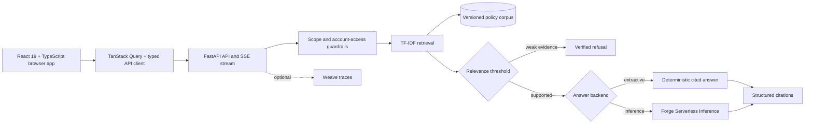

# Verified Support Assistant

[](https://github.com/thedev15/verified-support-assistant/actions/workflows/ci.yml)

A portfolio-quality, citation-first e-commerce support assistant. It retrieves
relevant policy excerpts, refuses requests it cannot verify or perform, and can
generate answers with either a deterministic no-cost baseline or CoreWeave
Forge Serverless Inference.

> **Status:** VSA 0.3 is a full-stack React 19 + FastAPI application with a
> typed OpenAPI contract, streaming verification progress, policy and
> evaluation workspaces, local conversation history, optional hosted-model
> generation, and reproducible CoreWeave Sandbox browser evidence.

## Why this project exists

Many chatbot demos optimize for fluent answers and ignore whether an answer is
supported. This project treats groundedness as a product requirement:

- every supported answer includes structured citations;
- weak or out-of-scope matches are refused;
- requests requiring private account access or transactions are rejected;
- retrieval, refusal behavior, and answer content are evaluated separately;
- paid model calls are optional and bounded.

## Baseline results

Measured on `data/eval_set.json` (40 curated questions, including adversarial
and account-action cases, 2026-10-02) with the current deterministic gate:

| Metric | Result |
|---|---:|
| Retrieval accuracy (expected policy in top 3) | 100% |
| Refusal accuracy | 100% |
| Required-keyword coverage | 100% |
| Python unit and API tests | 33/33 passing |
| React component/accessibility tests | 5/5 passing |

These results validate the synthetic benchmark only. They are not a
production-quality claim; the next milestone evaluates generated answers with
live models.

The original tracked [W&B baseline](https://wandb.ai/p-akinloye-cse2023016-obafemi-awolowo-university/verified-support-assistant/runs/iluo11jx)
recorded 92% keyword coverage. The browser evidence gate later exposed two
top-policy errors hidden by top-3 retrieval; deterministic domain routing and
regression tests corrected both in the current branch.

## Live UI evidence

[`docs/live-demo/live-demo-results.md`](docs/live-demo/live-demo-results.md)
contains 40 browser screenshots produced by submitting every versioned
benchmark question through the real page and `/api/ask` endpoint. Each capture
shows the submitted question, verified answer or safe refusal, backend, and
the exact policy citation used. The JSON manifest records complete API
responses, screenshot hashes, dimensions, and pass/fail assertions.

```bash
python scripts/capture_live_demo.py --base-url http://localhost:8000
```

The capture fails unless refusal accuracy and cited-document accuracy are both
100%, all 40 PNGs are present and unique, axe finds no serious/critical
accessibility violations, and the evidence ZIP passes its CRC check. The
committed set was captured in a private, bounded CoreWeave Sandbox;
[`sandbox-capture.json`](docs/live-demo/sandbox-capture.json) records its ID and
hard expiry. This verifies the deployed runtime but is not a claim of durable
or publicly available production deployment.

## Experiment tracking

The finished W&B baseline run includes the four summary metrics, all 40
case-level outputs in a Table, the exact Git commit, configuration, and a code
snapshot:

- [baseline-tfidf-extractive-v1](https://wandb.ai/p-akinloye-cse2023016-obafemi-awolowo-university/verified-support-assistant/runs/iluo11jx)
- [live-eval-meta-llama-llama-3-1-8b-instruct](https://wandb.ai/p-akinloye-cse2023016-obafemi-awolowo-university/verified-support-assistant/runs/fcjje8yi)
- [live-eval-ibm-granite-granite-4-2-8b](https://wandb.ai/p-akinloye-cse2023016-obafemi-awolowo-university/verified-support-assistant/runs/1uck3atj)

Future hosted-model evaluations use one run per model/configuration so latency,
token use, grounded citation behavior, and answer quality can be compared
without mixing conditions.

## Hosted-model results

The controlled comparison used 25 model requests per condition, temperature 0,
and a 220-token completion cap. See the live
[W&B evaluation report](https://wandb.ai/p-akinloye-cse2023016-obafemi-awolowo-university/verified-support-assistant/reports/Verified-Support-Assistant-Model-Evaluation--VmlldzoxODA0MzI5OQ)
and the repository's [detailed case study](reports/model_comparison.md).

| Condition | Refusal | Citation validity | Keyword coverage | Mean latency | Completion tokens |
|---|---:|---:|---:|---:|---:|
| Extractive baseline | **100%** | n/a | **92%** | n/a | 0 |
| Llama 3.1 8B | 97.5% | **91.7%** | 75% | **0.172 s** | **598** |
| Granite 4.2 8B | **100%** | 28% | 26% | 1.671 s | 4,917 |

**Decision:** retain extractive mode as the safe default and use Llama 3.1 8B
when generated answers are needed. Granite reached the completion limit on
16/25 calls and produced 15 blank visible answers because internal reasoning
consumed the 220-token budget. The API now converts blank generations to safe
refusals and exposes `finish_reason` for observability.

## Architecture



## Features

- React 19, TypeScript, Vite, React Router, and TanStack Query frontend
- OpenAPI-generated API types; frontend/backend schema drift fails the build
- FastAPI backend with SSE verification progress, policy/evaluation APIs,
  request IDs, latency, startup validation, and defensive browser headers
- Responsive support studio with desktop rail/mobile tabs, dark/light themes,
  conversation timeline, evidence drawer, local history, export, and copy/reset
- Dedicated About, policy library/detail, and interactive evaluation pages
- Inspectable TF-IDF retrieval baseline
- Twelve synthetic policy documents spanning shipping, returns, refunds,
  payments, warranties, security, international orders, and gift cards
- Deterministic extractive mode requiring no API calls
- Optional OpenAI-compatible Forge Inference backend
- Explicit guardrails for account-specific, transactional, and out-of-scope requests
- Structured citations with document IDs, sources, and relevance scores
- Deterministic evaluation suite and unit tests
- Optional Weave tracing
- Non-root Docker packaging and least-privilege GitHub Actions CI
- Reproducible Make targets, local-development guide, API reference,
  architecture notes, contribution guide, and security policy

## Quick start

Prerequisites: Python 3.11+ and Node.js 22+.

```bash
git clone https://github.com/thedev15/verified-support-assistant.git
cd verified-support-assistant
python -m venv .venv
source .venv/bin/activate       # Windows: .venv\Scripts\activate
python -m pip install -e ".[dev]"
npm --prefix web ci
npm --prefix web run build
cp .env.example .env
make check
make run
```

Open <http://localhost:8000/assistant>. The production build is served by
FastAPI at the same origin. API documentation is at <http://localhost:8000/docs>;
policies, evaluations, and architecture notes are linked from the app.

The default `LLM_BACKEND=extractive` mode makes no paid model calls.
For Windows PowerShell, Docker, environment loading, browser capture, optional
Inference/Weave setup, and troubleshooting, see the
**[complete local-development guide](docs/LOCAL_DEVELOPMENT.md)**.

## Documentation

- [Local development and required tools](docs/LOCAL_DEVELOPMENT.md)
- [Architecture and design decisions](docs/ARCHITECTURE.md)
- [API contract and security headers](docs/API.md)
- [Operations, packaging, deployment, and rollback](docs/OPERATIONS.md)
- [Release changelog](CHANGELOG.md)
- [Contributing](CONTRIBUTING.md)
- [Security policy](SECURITY.md)
- [Verified browser evidence](docs/live-demo/README.md)

## Run a bounded CoreWeave Sandbox capture

The tested workflow creates a private Sandbox with a hard lifetime, 1 CPU, 2
GiB of memory, no GPU, and the no-inference `extractive` backend. It runs the
app and all 40 Chromium cases inside the Sandbox, validates the archive, and
copies evidence back to the repository.

```bash
python -m pip install -e ".[dev,sandbox]"
python scripts/deploy_sandbox_demo.py --lifetime-minutes 90 --private-capture
```

This is verification of an isolated deployed runtime, not a public or durable
production endpoint. Public service placement depends on runner capability and
is not assumed. Stop successful temporary Sandboxes after evidence retrieval
and check current Forge billing before use.

## Use Forge Serverless Inference

1. Copy `.env.example` to `.env` and load the variables in your shell.
2. Set `LLM_BACKEND=inference`.
3. Set `WANDB_API_KEY`, `WANDB_ENTITY`, and `WANDB_PROJECT`.
4. Confirm `INFERENCE_MODEL` is an exact model ID visible to your account.
5. Start with a small, bounded evaluation because inference consumes credits.

The client uses `https://api.inference.wandb.ai/v1` and attributes usage to
`WANDB_ENTITY/WANDB_PROJECT` when both are supplied.

## Enable Weave tracing

Set:

```bash
ENABLE_WEAVE=true
WEAVE_PROJECT=your-team/verified-support-assistant
```

Weave tracing is independent of Inference billing attribution. Keep both
projects explicit so traces and usage land where expected.

## Evaluate

```bash
python -m support_assistant.evaluate
```

The benchmark intentionally separates:

- **retrieval accuracy:** was the expected policy retrieved in the cited set?
- **refusal accuracy:** did the assistant answer supported questions and refuse
  unsupported ones?
- **keyword coverage:** did the deterministic answer preserve required facts?

The hosted-model harness refuses to start if the planned number of model calls
exceeds its hard cap. On the current 40-case set, only the 25 supported cases
reach the model; guardrail and low-relevance refusals do not consume inference:

```bash
python scripts/run_live_eval.py \
  --entity your-team \
  --project verified-support-assistant \
  --model meta-llama/Llama-3.1-8B-Instruct \
  --max-paid-calls 25 \
  --max-tokens 220 \
  --weave
```

That limits each model condition to 25 requests and at most 5,500 generated
tokens. The script logs case-level outputs, latency, actual token use, citation
validity, refusal accuracy, retrieval accuracy, and keyword coverage to W&B.

## API example

```bash
curl -s http://localhost:8000/api/ask \
  -H 'Content-Type: application/json' \
  -d '{"question":"How long does a card refund take?"}'
```

## Repository layout

```text
support_assistant/
  api.py            FastAPI application and optional Weave initialization
  config.py         Environment-based configuration
  generation.py     Extractive and Forge Inference answer backends
  knowledge.py      Corpus loading and validation
  retrieval.py      TF-IDF ranking
  service.py        Guardrails, thresholding, citations, orchestration
  evaluate.py       Deterministic benchmark runner
  static/           Generated React production bundle (committed release asset)
web/
  src/              React 19 + TypeScript source, components, routes, tests
  package.json      Vite build, Vitest, type generation, and checks
data/
  knowledge_base.json
  eval_set.json
docs/
  LOCAL_DEVELOPMENT.md
  ARCHITECTURE.md
  API.md
  live-demo/
tests/
```

## Safety and limitations

- The corpus and policy content are synthetic. Policy citations resolve to
  pages served by this demo; the assistant is not connected to a real retailer.
- It cannot inspect accounts, track live orders, take payment, or place orders.
- Regex guardrails and TF-IDF retrieval are transparent baselines, not complete
  defenses against adversarial prompts.
- Live-model quality and cost must be measured before deployment.
- Do not place secrets in `.env` files committed to Git.

## Roadmap

- [x] Versioned synthetic knowledge base
- [x] Retrieval and refusal baseline
- [x] Web/API interface
- [x] Unit and deterministic evaluation tests
- [x] Larger adversarial evaluation set and enforced metric gates
- [x] Reproducible W&B baseline run with case-level evaluation table
- [x] Bounded comparison of two hosted models/configurations
- [x] Weave traces and W&B evaluation report
- [x] Bounded CoreWeave Sandbox capture and verified browser evidence
- [x] Modern responsive UI, About/policy discovery, and complete local docs
- [x] React/TypeScript studio, generated API types, SSE progress, and eval UI
- [x] 40-case CoreWeave Sandbox browser and accessibility verification

## License

MIT