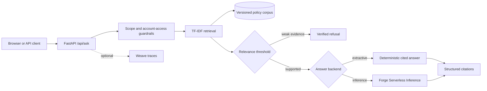

# Verified Support Assistant

[](https://github.com/thedev15/verified-support-assistant/actions/workflows/ci.yml)

A portfolio-quality, citation-first e-commerce support assistant. It retrieves
relevant policy excerpts, refuses requests it cannot verify or perform, and can
generate answers with either a deterministic no-cost baseline or CoreWeave
Forge Serverless Inference.

> **Status:** the deterministic baseline, expanded benchmark, API, interface,
> CI, and W&B experiment record are complete. A bounded live-model comparison,
> Weave analysis, and deployment are the remaining milestones.

## Why this project exists

Many chatbot demos optimize for fluent answers and ignore whether an answer is
supported. This project treats groundedness as a product requirement:

- every supported answer includes structured citations;
- weak or out-of-scope matches are refused;
- requests requiring private account access or transactions are rejected;
- retrieval, refusal behavior, and answer content are evaluated separately;
- paid model calls are optional and bounded.

## Baseline results

Measured on `data/eval_set.json` (40 curated questions, including adversarial
and account-action cases, 2026-10-02) and recorded in
[W&B](https://wandb.ai/p-akinloye-cse2023016-obafemi-awolowo-university/verified-support-assistant/runs/iluo11jx):

| Metric | Result |
|---|---:|
| Retrieval accuracy (expected policy in top 3) | 100% |
| Refusal accuracy | 100% |
| Required-keyword coverage | 92% |
| Core unit tests | 11/11 passing |

These results validate the synthetic benchmark only. They are not a
production-quality claim; the next milestone evaluates generated answers with
live models.

## Experiment tracking

The finished W&B baseline run includes the four summary metrics, all 40
case-level outputs in a Table, the exact Git commit, configuration, and a code
snapshot:

- [baseline-tfidf-extractive-v1](https://wandb.ai/p-akinloye-cse2023016-obafemi-awolowo-university/verified-support-assistant/runs/iluo11jx)

Future hosted-model evaluations use one run per model/configuration so latency,
token use, grounded citation behavior, and answer quality can be compared
without mixing conditions.

## Architecture



## Features

- FastAPI backend and responsive single-page interface
- Inspectable TF-IDF retrieval baseline
- Twelve synthetic policy documents spanning shipping, returns, refunds,
  payments, warranties, security, international orders, and gift cards
- Deterministic extractive mode requiring no API calls
- Optional OpenAI-compatible Forge Inference backend
- Explicit guardrails for account-specific, transactional, and out-of-scope requests
- Structured citations with document IDs, sources, and relevance scores
- Deterministic evaluation suite and unit tests
- Optional Weave tracing
- Docker packaging and GitHub Actions CI

## Quick start

Prerequisites: Python 3.11+.

```bash
git clone https://github.com/thedev15/verified-support-assistant.git
cd verified-support-assistant
python -m venv .venv
source .venv/bin/activate       # Windows: .venv\Scripts\activate
python -m pip install -e ".[dev]"
cp .env.example .env
make test
make evaluate
make run
```

Open <http://localhost:8000>. API documentation is available at
<http://localhost:8000/docs>.

The default `LLM_BACKEND=extractive` mode makes no paid model calls.

## Use Forge Serverless Inference

1. Copy `.env.example` to `.env` and load the variables in your shell.
2. Set `LLM_BACKEND=inference`.
3. Set `WANDB_API_KEY`, `WANDB_ENTITY`, and `WANDB_PROJECT`.
4. Confirm `INFERENCE_MODEL` is an exact model ID visible to your account.
5. Start with a small, bounded evaluation because inference consumes credits.

The client uses `https://api.inference.wandb.ai/v1` and attributes usage to
`WANDB_ENTITY/WANDB_PROJECT` when both are supplied.

## Enable Weave tracing

Set:

```bash
ENABLE_WEAVE=true
WEAVE_PROJECT=your-team/verified-support-assistant
```

Weave tracing is independent of Inference billing attribution. Keep both
projects explicit so traces and usage land where expected.

## Evaluate

```bash
python -m support_assistant.evaluate
```

The benchmark intentionally separates:

- **retrieval accuracy:** was the expected policy retrieved in the cited set?
- **refusal accuracy:** did the assistant answer supported questions and refuse
  unsupported ones?
- **keyword coverage:** did the deterministic answer preserve required facts?

The hosted-model harness refuses to start if the planned number of model calls
exceeds its hard cap. On the current 40-case set, only the 25 supported cases
reach the model; guardrail and low-relevance refusals do not consume inference:

```bash
python scripts/run_live_eval.py \
  --entity your-team \
  --project verified-support-assistant \
  --model meta-llama/Llama-3.1-8B-Instruct \
  --max-paid-calls 25 \
  --max-tokens 220 \
  --weave
```

That limits each model condition to 25 requests and at most 5,500 generated
tokens. The script logs case-level outputs, latency, actual token use, citation
validity, refusal accuracy, retrieval accuracy, and keyword coverage to W&B.

## API example

```bash
curl -s http://localhost:8000/api/ask \
  -H 'Content-Type: application/json' \
  -d '{"question":"How long does a card refund take?"}'
```

## Repository layout

```text
support_assistant/
  api.py            FastAPI application and optional Weave initialization
  config.py         Environment-based configuration
  generation.py     Extractive and Forge Inference answer backends
  knowledge.py      Corpus loading and validation
  retrieval.py      TF-IDF ranking
  service.py        Guardrails, thresholding, citations, orchestration
  evaluate.py       Deterministic benchmark runner
data/
  knowledge_base.json
  eval_set.json
tests/
```

## Safety and limitations

- The corpus and URLs are synthetic and marked with the reserved `.invalid`
  domain. This assistant is not connected to a real retailer.
- It cannot inspect accounts, track live orders, take payment, or place orders.
- Regex guardrails and TF-IDF retrieval are transparent baselines, not complete
  defenses against adversarial prompts.
- Live-model quality and cost must be measured before deployment.
- Do not place secrets in `.env` files committed to Git.

## Roadmap

- [x] Versioned synthetic knowledge base
- [x] Retrieval and refusal baseline
- [x] Web/API interface
- [x] Unit and deterministic evaluation tests
- [x] Larger adversarial evaluation set and enforced metric gates
- [x] Reproducible W&B baseline run with case-level evaluation table
- [ ] Bounded comparison of two hosted models/configurations
- [ ] Weave traces and W&B evaluation report
- [ ] Deployment and recorded demo

## License

MIT