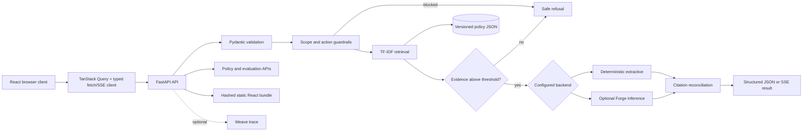

# Architecture and design decisions

Verified Support Assistant is intentionally small enough to inspect end to end.
It separates evidence retrieval, policy enforcement, generation, presentation,
and evaluation so each behavior can be tested independently.

## Request flow

## Components

| Path | Responsibility |
|---|---|
| `support_assistant/api.py` | HTTP routes, metadata, security headers, static files |
| `support_assistant/config.py` | Environment settings and fail-fast validation |
| `support_assistant/knowledge.py` | Load and validate the versioned corpus |
| `support_assistant/retrieval.py` | Transparent TF-IDF ranking |
| `support_assistant/service.py` | Guardrails, thresholds, routing, citation reconciliation |
| `support_assistant/generation.py` | Extractive and optional hosted-model backends |
| `support_assistant/models.py` | Validated request and response contracts |
| `support_assistant/static/` | Generated, hashed React release bundle served by FastAPI |
| `support_assistant/evaluate.py` | Deterministic benchmark evaluation |
| `web/src/api/` | Typed JSON/SSE client and generated OpenAPI declarations |
| `web/src/components/` | Reusable shell, composer, timeline, evidence, and UI primitives |
| `web/src/pages/` | Assistant, policy, evaluation, and About route modules |
| `web/src/styles/` | Design tokens, responsive layout, focus, motion, and print rules |

## Evidence and citation contract

The policy corpus is JSON committed under `data/`. Each document has a stable
ID, title, in-app source URL, and text. Retrieval may inspect multiple
candidates, but the API returns only documents whose IDs appear in the final
answer. A supported answer therefore cannot display an unrelated candidate as
if it were evidence.

Low similarity, account-specific actions, requests for secrets, unsupported
domains, and prompt-injection patterns produce the same explicit refusal. This
is a transparent baseline, not a complete adversarial defense.

## Frontend architecture

The browser client is a React 19 single-page application built with TypeScript
and Vite. React Router owns five deep-linkable workspaces: Assistant, Policies,
Policy detail, Evaluations, and About. TanStack Query handles server state;
conversation history and the selected thread stay local to the browser and are
never represented as server-side customer data.

The API remains the source of truth. `scripts/export_openapi.py` emits
`docs/openapi.json`, and `openapi-typescript` generates
`web/src/api/schema.d.ts`; `npm run build` regenerates the contract before
typechecking. The assistant uses `/api/ask/stream` for deterministic SSE stage
events and the final typed result. Other views use `/api/meta`, `/api/policies`,
`/api/policies/{id}`, and `/api/evaluations/latest`.

The component system uses semantic controls, visible focus, skip navigation,
ARIA live status, reduced-motion support, 44px touch targets, and responsive
desktop/mobile navigation. API content is rendered through React rather than
HTML injection. The Content Security Policy allows only same-origin production
scripts, styles, images, fonts, forms, and API connections.

## Build and packaging

`npm --prefix web run build` typechecks and writes hashed assets plus
`index.html` into `support_assistant/static/`. Setuptools includes the complete
nested static tree in the wheel. FastAPI mounts `/assets` and serves the SPA
shell for browser routes, while `/api/*`, `/health`, `/docs`, and
`/openapi.json` remain normal server endpoints. The Dockerfile repeats the same
build in a Node stage and copies only the production bundle into a non-root
Python runtime image.

Source and release assets are both kept in the repository intentionally:
`web/` is reviewable source, while `support_assistant/static/` makes a Python
wheel runnable without Node at runtime. CI rebuilds the bundle to catch drift.

## Operational posture

- The default backend is deterministic and incurs no model cost.
- Settings are validated at process startup.
- API responses are marked `no-store` and include a request ID and latency.
- The Docker image runs as a non-root user and declares a health check.
- CI uses least-privilege repository permissions, concurrency cancellation,
  Python lint/format/tests/evaluation plus frontend typecheck/tests/build.
- Sandbox capture has explicit resource and lifetime bounds.

## Intentional limitations

VSA is not connected to accounts, orders, payments, inventory, or carrier
systems. It does not authenticate users or persist conversations. Those are
appropriate omissions for a public synthetic demo; a production system would
need identity, authorization, rate limiting, audit retention, abuse controls,
privacy review, secrets management, monitored dependencies, and service-level
objectives before handling real customer data.