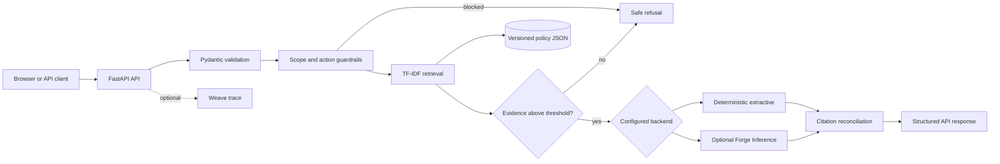

# Architecture and design decisions

Verified Support Assistant is intentionally small enough to inspect end to end.
It separates evidence retrieval, policy enforcement, generation, presentation,
and evaluation so each behavior can be tested independently.

## Request flow

## Components

| Path | Responsibility |
|---|---|
| `support_assistant/api.py` | HTTP routes, metadata, security headers, static files |
| `support_assistant/config.py` | Environment settings and fail-fast validation |
| `support_assistant/knowledge.py` | Load and validate the versioned corpus |
| `support_assistant/retrieval.py` | Transparent TF-IDF ranking |
| `support_assistant/service.py` | Guardrails, thresholds, routing, citation reconciliation |
| `support_assistant/generation.py` | Extractive and optional hosted-model backends |
| `support_assistant/models.py` | Validated request and response contracts |
| `support_assistant/static/` | Progressive, framework-free browser UI |
| `support_assistant/evaluate.py` | Deterministic benchmark evaluation |

## Evidence and citation contract

The policy corpus is JSON committed under `data/`. Each document has a stable
ID, title, in-app source URL, and text. Retrieval may inspect multiple
candidates, but the API returns only documents whose IDs appear in the final
answer. A supported answer therefore cannot display an unrelated candidate as
if it were evidence.

Low similarity, account-specific actions, requests for secrets, unsupported
domains, and prompt-injection patterns produce the same explicit refusal. This
is a transparent baseline, not a complete adversarial defense.

## Frontend architecture

The frontend has no compilation or third-party runtime dependency:

- semantic HTML for navigation, form controls, live status, and documents;
- one layered responsive stylesheet with dark/light themes, reduced-motion,
  focus, print, and mobile behavior;
- one strict JavaScript module for API calls and safe DOM construction;
- no `innerHTML` for API content;
- request timeout, validation, copy/reset actions, and keyboard submission;
- runtime metadata from `/api/meta`, not hardcoded backend status.

The Content Security Policy allows only same-origin scripts, styles, images,
forms, and API connections. The UI still exposes policy and OpenAPI pages when
JavaScript is disabled.

## Operational posture

- The default backend is deterministic and incurs no model cost.
- Settings are validated at process startup.
- API responses are marked `no-store` and include a request ID and latency.
- The Docker image runs as a non-root user and declares a health check.
- CI uses least-privilege repository permissions, concurrency cancellation,
  lint, format, tests, and deterministic evaluation.
- Sandbox capture has explicit resource and lifetime bounds.

## Intentional limitations

VSA is not connected to accounts, orders, payments, inventory, or carrier
systems. It does not authenticate users or persist conversations. Those are
appropriate omissions for a public synthetic demo; a production system would
need identity, authorization, rate limiting, audit retention, abuse controls,
privacy review, secrets management, monitored dependencies, and service-level
objectives before handling real customer data.